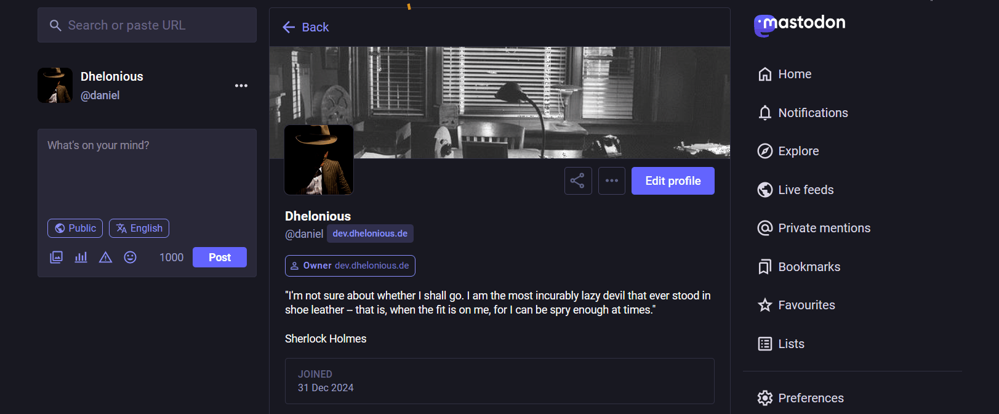
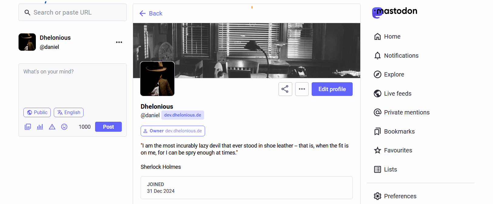
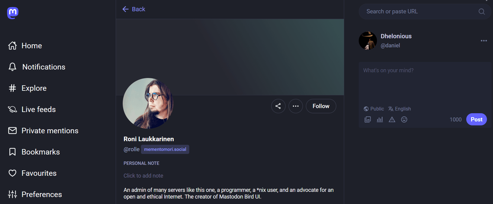
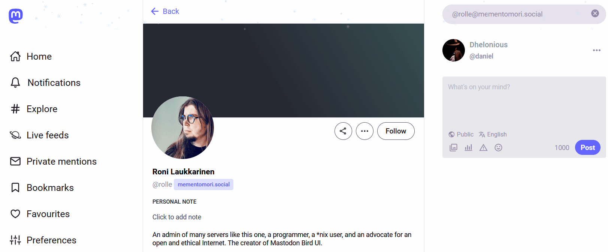

Unofficial snap for Mastodon 🦣📦

# 📌 About

The [Fediverse](https://en.wikipedia.org/wiki/Fediverse) is intended to remove the dependency on a single service provider. But users are still dependent on the instance providers. While a user can register with multiple instances and switch between them, their data is still tied to one instance at a time. In addition, users still do not have full control over their own data.

So anyone should be able to host their own Mastodon instance on a home server, an old PC, a VPS or even a RasPi. However, creating a Mastodon instance requires some advanced knowledge and skills. The officially provided [Docker Compose file](https://github.com/mastodon/mastodon/blob/main/docker-compose.yml) reduces the complexity by a good amount. However, some knowledge of Docker and some occasional debugging is still required.

The goal of this project is to further simplify the installation process of Mastodon to give everyone the ability to host their own fully functional (micro) instance of Mastodon without requiring any prior knowledge of the technology behind it. This all-in-one snap package also includes a database and support for ACME to automatically obtain SSL certificates for HTTPS. Because snaps are self-updating, the process of setting up a Mastodon instance can be reduced to the execution of a single command, with a minimum of future maintenance required.

Supported architectures:

* amd64

For more information, see the latest [release readme](RELEASE.md) or the [FAQ](docs/faq.md).

# 🚀 Quickstart

If you're not running Ubuntu, start by [installing the snap daemon](https://snapcraft.io/docs/installing-snapd#without-snap). Then run these commands:

    sudo snap install mastodon-server

    sudo mastodon-server.setup

🥳 Congratulations! You now have your very own Mastodon instance! 🎉

> [!IMPORTANT]
> An administrator account with a randomly generated password is created during setup. Some usernames such as `admin` and `administrator` are reserved by Mastodon. See the [FAQ](docs/faq.md) for a full list.

# 📦 Installation

If you prefer, you can also install the snap directly from the command line:

    sudo snap install mastodon-server

A common criticism of snaps is their dependence on Canonical. However, it is possible to install snaps offline and also build them locally directly from source. See the [build instructions](docs/build.md) for how to do this.

## Install from a snap file

Download a snap file from the [releases page](https://github.com/dhelonious/mastodon-snap/releases) and install it using:

    sudo snap install mastodon-server_VERSION_ARCH.snap --dangerous

> [!NOTE]
> In this context *dangerous* means that the snap file is not signed. This is normal for snaps built and distributed outside the snap store.

## Updates

A Snap Store installation is automatically updated when new versions are released.

> [!NOTE]
> Be aware that there will always be a short downtime due to the way snaps are updated.

To update your local installation, you can simply repeat the steps above with a newer version of the snap file. This will update your Mastodon instance in-place by creating a new snap revision.

If you have installed a snap file locally and still want to benefit from automatic updates, you can switch to the Snap Store installation using:

    snap refresh --amend mastodon-server

After the snap has updated itself, a new unpublished announcement will be created. You can view, publish or delete this announcement in *Preferences/Administration/Announcements*.

> [!NOTE]
> By default, `update.announcement` is enabled (see the [configuration docs](docs/configuration.md)), which will display an update announcement 3 minutes before the snap is updated. This will prolong the time the snap is on hold during a refresh.

### Refresh timer

If you want to control the times at which snaps are updated, you need to change the [refresh.timer](https://snapcraft.io/docs/managing-updates#p-32248-refreshtimer):

    snap set system refresh.timer=03:00

You can check the current settings with:

    snap refresh --time

# 🦣 Setup your instance

An initial setup command is required to initialize the database and configuration files for Mastodon:

    sudo mastodon-server.setup

> [!NOTE]
> Be patient if you have changed the `status.length` as it takes some time to recompile the assets, especially if there is a small amount of RAM available. Ideally these values should be changed before setup. Otherwise you may want to [increase swap space](https://www.baeldung.com/linux/increase-swap-space).

## SSL

SSL certificates can be obtained via ACME from either [Let's Encrypt](https://letsencrypt.org/), [ZeroSSL](https://zerossl.com/) or [BuyPass](https://buypass.com). This is done either during `mastodon-server.setup` or by using:

    mastodon-server.get-certificate

Use the `acme.server` setting to select the CA (see the [configuration docs](docs/configuration.md)).

> [!NOTE]
> `get-certificate` will automatically enable HTTPS on port `ports.https`.

> [!IMPORTANT]
> HTTP is no longer supported in production. Mastodon will always serve https:// links.

See the [certificates docs](docs/certificates.md) for advanced certificate topics.

## Backups

Read the [backups guide](docs/backups.md) to learn how to export and restore your Mastodon server.

## Themes

Coming from ~~Twitter~~ X and wanting a familiar look? Then the included [Mastodon Bird UI](https://github.com/ronilaukkarinen/mastodon-bird-ui) and [Tangerine UI](https://github.com/nileane/TangerineUI-for-Mastodon) themes might be for you. While *Mastodon Bird UI* retains the separation between dark, light and high contrast variants, *Tangerine UI* automatically switches to a light or dark variant depending on what your browser requests. You can change the theme in *Preferences/Appearance*.

> [!IMPORTANT]
> If you have a severe visual impairment, an [accessible version of the Bird UI theme](https://github.com/ronilaukkarinen/mastodon-bird-ui#how-to-install-an-accessible-version-built-for-people-with-serious-vision-impairment) is included by default with an increased font size. This theme is indicated by the phrase ***High contrast++***, which contains ***two plus signs*** and is translated into your selected language. In addition, this theme is marked with the ♿ ***emoji representing a person in a wheelchair*** as the [International Symbol of Access](https://en.wikipedia.org/wiki/International_Symbol_of_Access).

# ⚙️ Configuration

The command

    mastodon-server.tootctl

replaces the `sudo -u mastodon RAILS_ENV=production bin/tootctl` command often found in guides and documentations.

See the [configuration docs](docs/configuration.md) for a complete overview of the configuration variables and other commands.

# 🚧 Maintenance

Read the [maintenance guide](docs/maintenance.md) to learn how to access the database shell and perform other maintenance tasks on your instance.

The `mastodon-server.announce` command can be used to create automated server notifications in Mastodon.

# 🐣 Addons

## 🎊 It's your Fediday!

The day you joined the Fediverse will be celebrated by your instance with a rain of confetti! The confetti will only be visible to you when you're logged in.

> [!NOTE]
> This addon respects accessibility settings. It won't be used if you enable the setting *Preferences/Appearance/Reduce motion in animations*.

## ❄️ Let it snow

Around Christmas, winter comes to your Mastodon instance as snowflakes appear at the top of the website! This wonderful addon has been created by [Roni Laukkarinen](https://github.com/ronilaukkarinen).

> [!NOTE]
> This addon respects accessibility settings. It won't be used if you enable the setting *Preferences/Appearance/Reduce motion in animations*.

# 🔥 Troubleshooting

If you encounter a problem, check if it has already been solved in the [troubleshooting guide](docs/troubleshooting.md). Otherwise, open a new [issue on GitHub](https://github.com/dhelonious/mastodon-snap/issues).

# 🔗 Resources

- [Fedi.Tips](https://fedi.tips/) is a valuable resource for Mastodon and the Fediverse.
- [Fedi.Directory](https://fedi.directory/) can help you find interesting accounts to follow.
- [FediDB](https://fedidb.org/) provides statistics on the Fediverse.
- [FediBuzz Relay](https://relay.fedi.buzz/) can be used to follow hashtags on other instances.
