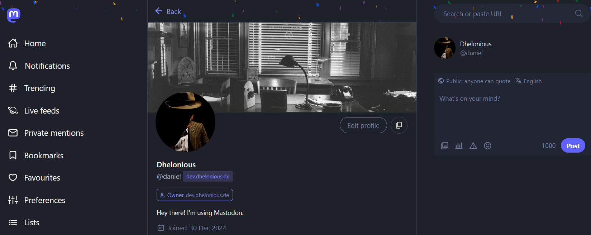

# 🧩 Features

## Wrapstodon

"Wrapstodon" is Mastodon's annual review of your activity. To generate it, run the command `mastodon-server.generate-wrapstodon`. Once the script has finished, each user will receive a notification prompting them to "View #Wrapstodon".

> [!NOTE]
> Depending on the number of eligible accounts, this may take a while.

## Fediday

Your instance will celebrate the day you joined the Fediverse properly with a shower of confetti when you access the web interface! This will only be visible to you when you're logged in.

> [!NOTE]
> This feature is designed to be unobtrusive and respects your accessibility settings. It will be disabled if you have enabled *Preferences/Appearance/Reduce motion in animations*.
