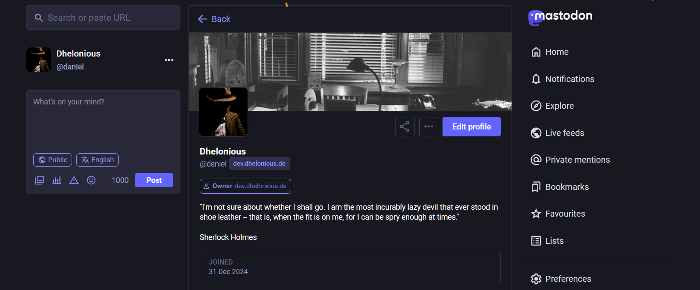

# 🧩 Features

## Fediday

Your instance will celebrate the day you joined the Fediverse properly with a shower of confetti when you access the web interface! This will only be visible to you when you're logged in.

> [!NOTE]
> This feature is designed to be unobtrusive and respects your accessibility settings. It will be disabled if you have enabled *Preferences/Appearance/Reduce motion in animations*.
